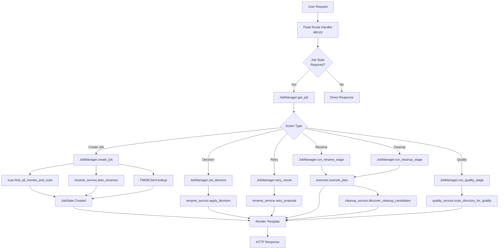
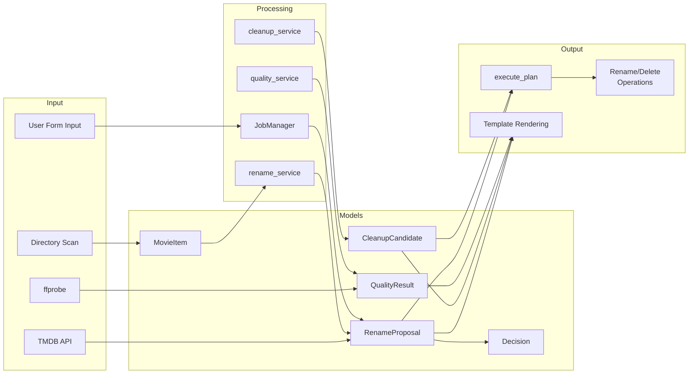

# ReelClean Architecture Reference

## 1. System Overview

ReelClean is a Flask-based web application that helps users organize movie files with a safe, review-first workflow. It provides a guided interface for:

- **Scanning** configured media directories for movie files
- **Generating** TMDB-based rename proposals (dry-run mode)
- **Reviewing** rename decisions (accept, skip, or retry with custom search)
- **Running** cleanup operations to remove sample files, non-media files, and empty folders
- **Analyzing** video quality using ffprobe

### Main Components

| Component | Purpose |
|-----------|---------|
| `app.py` | Flask entrypoint, route handlers, template rendering |
| `reelclean/core/config.py` | Environment-based configuration management |
| `reelclean/core/scan.py` | Filesystem scanning, title normalization |
| `reelclean/core/tmdb.py` | TMDB API client for movie lookups |
| `reelclean/core/rename_service.py` | Rename planning, conflict detection, decisions |
| `reelclean/core/quality_service.py` | Video quality analysis via ffprobe |
| `reelclean/core/cleanup_service.py` | Cleanup candidate discovery |
| `reelclean/core/executor.py` | Safe file rename and deletion execution |
| `reelclean/core/models.py` | Shared data models (JobState, proposals, results) |
| `reelclean/web/job_manager.py` | In-memory job workflow state management |

---

## 2. Architecture Flow

### Request Flow Diagram



### Data Model Flow



---

## 3. File/Module Inventory

### Core Application

| File | Purpose | Key Exports |
|------|---------|-------------|
| `app.py` | Flask app factory and route handlers | `create_app()`, all route functions |

### `reelclean/core/` Modules

| File | Purpose | Key Exports |
|------|---------|-------------|
| `models.py` | Data models for movies, proposals, decisions, results | `MovieItem`, `RenameProposal`, `CleanupCandidate`, `QualityResult`, `ExecutionResult`, `Decision`, `ProposalStatus`, `CleanupKind` |
| `config.py` | Environment variable parsing and directory discovery | `ReelCleanConfig`, `DirectoryOption`, `parse_allowed_dirs()`, `discover_directory_options()` |
| `scan.py` | Filesystem scanning for movies/subtitles, title cleaning | `find_all_movies_and_subs()`, `clean_title()`, `extract_year()`, `build_movie_id()`, `VIDEO_EXTS`, `SUB_EXT` |
| `tmdb.py` | TMDB API client with fallback matching strategies | `TMDBClient`, `TMDB_URL` |
| `rename_service.py` | Proposal planning, conflict detection, decision application | `plan_renames()`, `apply_decision()`, `retry_proposal()`, `recalculate_conflicts()` |
| `quality_service.py` | Video quality analysis using ffprobe | `scan_directory_for_quality()`, `run_ffprobe()`, `detect_quality_issues()` |
| `cleanup_service.py` | Cleanup candidate discovery | `discover_cleanup_candidates()`, `MOVIE_SAMPLE_PATTERNS` |
| `executor.py` | Safe rename and delete execution with root validation | `execute_plan()`, `_is_within_root()`, `_rename_path()`, `_delete_candidate()` |

### `reelclean/web/` Modules

| File | Purpose | Key Exports |
|------|---------|-------------|
| `job_manager.py` | Thread-safe in-memory job state management | `JobManager`, `JobState`, `JobNotFoundError`, `MODE_RENAME_ONLY`, `MODE_QUALITY_ONLY`, `MODE_RENAME_AND_QUALITY`, `VALID_MODES` |

### Templates

| Template | Purpose |
|----------|---------|
| `base.html` | Base layout with navbar, flash messages, Bootstrap setup |
| `index.html` | Home page: directory selection, job list, mode selection |
| `job_overview.html` | Job summary page |
| `dry_run.html` | Rename proposal review with accept/skip/retry actions |
| `cleanup.html` | Cleanup candidate review with checkboxes |
| `quality.html` | Quality scan results display |
| `results.html` | Final results summary |

### Static Assets

| Path | Purpose |
|------|---------|
| `static/css/base.css` | Global styles |
| `static/css/cleanup.css` | Cleanup page styles |
| `static/css/dry_run.css` | Dry-run page styles |
| `static/js/cleanup.js` | Cleanup page interactivity |

---

## 4. Dependency Map

### Dependency Graph

```
app.py
├── reelclean.core.config
│   └── (no internal deps)
├── reelclean.core.models
│   └── (no internal deps)
├── reelclean.core.tmdb
│   └── reelclean.core.models
└── reelclean.web.job_manager
    ├── reelclean.core.cleanup_service
    │   ├── reelclean.core.models
    │   └── reelclean.core.scan
    ├── reelclean.core.executor
    │   └── reelclean.core.models
    ├── reelclean.core.models
    ├── reelclean.core.quality_service
    │   └── reelclean.core.models
    ├── reelclean.core.rename_service
    │   ├── reelclean.core.models
    │   ├── reelclean.core.scan
    │   └── reelclean.core.tmdb
    ├── reelclean.core.scan
    │   └── reelclean.core.models
    └── reelclean.core.tmdb
        └── reelclean.core.models
```

### Entry Points

| Entry Point | Description |
|-------------|-------------|
| `python3 app.py` | Direct Flask development server |
| `flask run` | Via Flask CLI |
| `gunicorn app:app` | Production WSGI server |
| Docker: `docker run` | Containerized execution |

### Circular Dependencies

**None detected.** The dependency graph is acyclic:
- Core modules depend only on `models.py` (no circular refs)
- `web/job_manager.py` depends on all core services
- No module depends on `app.py`

### Core Dependencies

| Module | Depends On |
|--------|------------|
| `scan.py` | `models.py`, `unidecode` (optional) |
| `tmdb.py` | `models.py`, `requests` |
| `rename_service.py` | `models.py`, `scan.py`, `tmdb.py` |
| `quality_service.py` | `models.py`, `subprocess`, `json` |
| `cleanup_service.py` | `models.py`, `scan.py` |
| `executor.py` | `models.py` |
| `job_manager.py` | All core services + `models.py` |

---

## 5. Data Flow

### Workflow: Create and Execute Job

```
1. User submits job creation form (POST /jobs)
   ├── Selected directory validated against allowed roots
   ├── Mode validated (RENAME_ONLY, QUALITY_ONLY, RENAME_AND_QUALITY)
   │
2. JobManager.create_job()
   ├── scan.find_all_movies_and_subs(root_dir) → List[MovieItem]
   ├── rename_service.plan_renames(movies, root_dir, tmdb_client)
   │   ├── For each movie: tmdb_client.lookup() → TmdbMatch
   │   ├── Build RenameProposal with target paths
   │   └── recalculate_conflicts() → detect duplicates/existing files
   │
3. JobState created with status="planned" (or "quality_ready" for quality-only)
   │
4. Redirect to dry_run_page or quality_page

5. User reviews proposals on dry_run.html
   ├── Accept: JobManager.set_decision() → apply_decision()
   ├── Skip: JobManager.set_decision() → apply_decision()
   ├── Retry: JobManager.retry_movie() → retry_proposal()
   │
6. User clicks "Run Renames" (POST /jobs/<id>/run-renames)
   ├── JobManager.run_rename_stage()
   │   ├── executor.execute_plan(proposals, [])
   │   │   ├── For each ACCEPTED proposal: rename files
   │   │   ├── Validate paths stay within safe_root
   │   │   └── Return ExecutionResult
   │   └── cleanup_service.discover_cleanup_candidates() → cleanup_candidates
   │
7. Redirect to cleanup_page

8. User reviews cleanup candidates (POST /jobs/<id>/cleanup)
   ├── JobManager.run_cleanup_stage(selected_ids)
   │   ├── executor.execute_plan([], selected_candidates)
   │   │   └── Delete selected files/folders
   │   └── If quality mode: quality_service.scan_directory_for_quality()
   │
9. Redirect to quality_page or results_page
```

### Data Models in Flow

```
MovieItem
    ↓ (with TMDB match)
RenameProposal
    ↓ (with decision)
JobState.proposals
    ↓ (execute)
ExecutionResult.rename_operations

MovieItem (from scan)
    ↓
CleanupCandidate (from cleanup_service)
    ↓ (selected by user)
ExecutionResult.cleanup_operations

Directory scan
    ↓ (ffprobe analysis)
QualityResult
    ↓
JobState.quality_results
```

---

## 6. Key Interactions

### Common User Flows

#### Flow 1: Rename-Only Job
```
1. index.html → Select "Rename only" mode + directory
2. POST /jobs → create_job() → dry_run_page
3. dry_run.html → Review proposals, accept/skip/retry
4. POST /jobs/<id>/run-renames → run_rename_stage()
5. cleanup.html → Select cleanup candidates (optional)
6. POST /jobs/<id>/cleanup → run_cleanup_stage()
7. results.html → View rename/cleanup results
```

#### Flow 2: Quality-Only Job
```
1. index.html → Select "Quality check only" mode + directory
2. POST /jobs → create_job() → quality_page (skips dry-run)
3. quality_page → View quality scan results
4. results.html (redirected)
```

#### Flow 3: Rename + Quality Job
```
1. index.html → Select "Rename + quality check" mode + directory
2. POST /jobs → create_job() → dry_run_page
3. dry_run.html → Review and decide on proposals
4. POST /jobs/<id>/run-renames → run_rename_stage()
5. cleanup.html → Select cleanup candidates
6. POST /jobs/<id>/cleanup → run_cleanup_stage()
7. quality_page → View quality results (post-cleanup)
```

### Key File Interactions

| Interaction | Files Involved |
|-------------|----------------|
| Job creation | `app.py:create_job_route()` → `job_manager.py:create_job()` → `scan.py:find_all_movies_and_subs()` → `rename_service.py:plan_renames()` |
| TMDB lookup | `rename_service.py:plan_rename_for_movie()` → `tmdb.py:TMDBClient.lookup()` |
| Conflict detection | `rename_service.py:recalculate_conflicts()` - checks duplicate targets and existing files |
| Safe rename | `executor.py:execute_plan()` → `_rename_path()` - validates root containment |
| Safe delete | `executor.py:execute_plan()` → `_delete_candidate()` - validates root containment |
| Quality scan | `quality_service.py:scan_directory_for_quality()` → `run_ffprobe()` - subprocess call |

---

## 7. Extension Points

### Where to Add New Features

| Feature Type | Files to Modify | New Files to Create |
|--------------|----------------|---------------------|
| **New job mode** | `job_manager.py` (add MODE_*, update JobState), `app.py` (new route), `models.py` (optional new model) | New template if UI needed |
| **New rename source** | `rename_service.py` (new lookup function), potentially `tmdb.py` | New service file (e.g., `imdb.py`) |
| **New cleanup detection** | `cleanup_service.py` (add new `_is_*` function), `models.py` (add CleanupKind) | - |
| **Quality metric** | `quality_service.py` (add detection), `models.py` (add QualityResult field) | - |
| **New UI page** | `app.py` (add route + handler), `templates/` | New template, optional CSS/JS |
| **Alternative storage** | `job_manager.py` (replace in-memory dict), `app.py` (pass session/config) | New storage adapter |

### Configuration Extension

To add new configuration:
1. `config.py` - Add field to `ReelCleanConfig` + parsing in `from_env()`
2. `.env.example` - Document new variable
3. Update `README.md` if user-facing

### Adding a New Service

Example: Add Trakt.tv integration for watchlist:

```
1. Create reelclean/core/trakt.py
   - Import: from .models import WatchlistItem
   - Exports: class TraktClient, fetch_watchlist()
   
2. Update reelclean/core/__init__.py
   - Add: from .trakt import TraktClient, fetch_watchlist
   - Add to __all__: "TraktClient", "fetch_watchlist"
   
3. Update job_manager.py
   - Import: from reelclean.core.trakt import fetch_watchlist
   - Add method: JobManager.enrich_with_watchlist()
   
4. Update app.py or template
   - Import and use new functionality
```

### Testing Extension Points

| Component | Test File |
|-----------|-----------|
| Core services | `tests/test_*.py` (rename, cleanup, quality, scan, config) |
| Web flow | `tests/test_web_app.py`, `tests/test_job_manager.py` |
| Integration | `tests/test_integration_flow.py` |
| Safety | `tests/test_executor_safety.py` |

Run tests:
```bash
python3 -m unittest discover -s tests
```

---

## 8. Environment Configuration

| Variable | Default | Purpose |
|----------|---------|---------|
| `TMDB_API_KEY` | (none) | TMDB API key for movie lookups |
| `TMDB_TIMEOUT_SECONDS` | 10 | API request timeout |
| `FFPROBE_BIN` | ffprobe | ffprobe binary path |
| `FLASK_SECRET_KEY` | reelclean-dev-secret | Session encryption |
| `REELCLEAN_HOST` | 0.0.0.0 | Bind address |
| `REELCLEAN_PORT` | 8000 | Bind port |
| `REELCLEAN_ALLOWED_DIRS` | (none) | Comma-separated `label:path` pairs |
| `REELCLEAN_LIBRARY_ROOT` | (none) | Auto-discover subdirectories |

---

## 9. Dependencies Summary

### Runtime Dependencies

| Package | Version | Purpose |
|---------|---------|---------|
| Flask | ≥3.0, <4.0 | Web framework |
| gunicorn | ≥22.0, <23.0 | WSGI server |
| python-dotenv | ≥1.0, <2.0 | .env file loading |
| requests | ≥2.32, <3.0 | HTTP client for TMDB |
| Unidecode | ≥1.3, <2.0 | ASCII transliteration |

### System Dependencies

| Tool | Purpose |
|------|---------|
| ffprobe | Video quality analysis (from ffmpeg) |
| Python 3.11+ | Runtime |

---

*Generated from codebase analysis. Last updated: 2026-03-28*
